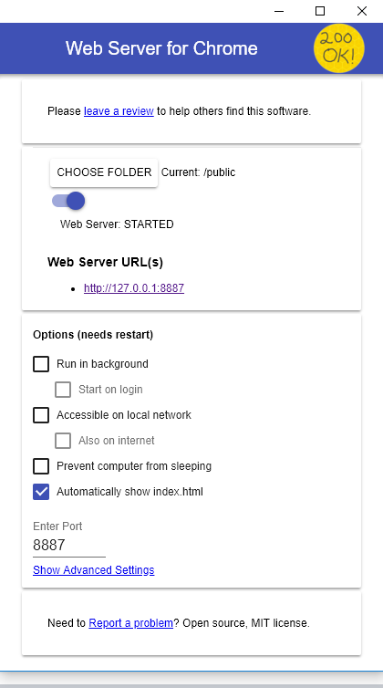
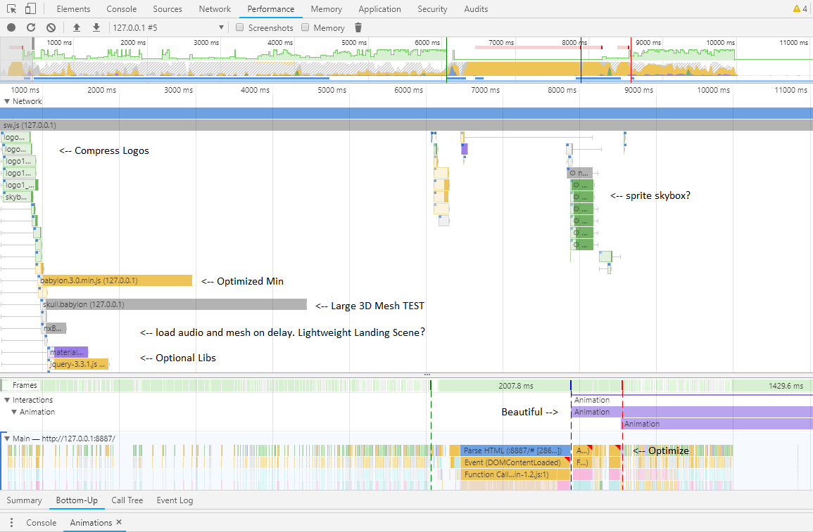

# 3D-PWA-Appshell-Template
PWA Template with BabylonJS
# A 3D Progressive Web Appshell Template

Powered by:

[](https://www.babylonjs.com/)

Progressive Web Applications are the next big innovation for the world wide web for creative HTML5 App developers. The technology takes any Web Page and allows it to be saved to a users "Homescreen" for easy access anytime. Now with BabylonJS, take your 3D skills to the "Home screen" with no app store necessary. Use this template to gost 3D PWA's from your SSL Website. 

## Example
- [AppShellTemplate](https://www.anmscape.com/AppShellTemplate/public/index.html) : FREE MIT Demo.


## WARNING

Be sure to check the W3C compatibility tables before going to production. PWA technology is a "Progressive Enhancement" (meaning it is a vanilla web site), and it is all subject to change. So it is best to watch for browser support for the [Web App Manifest](https://developer.mozilla.org/en-US/docs/Web/Manifest#Browser_compatibility) in particular. It is not as well supported as the [Service Worker](https://developer.mozilla.org/en-US/docs/Web/API/Service_Worker_API#Specifications). So we watch [caniuse Service Workers](https://caniuse.com/#feat=serviceworkers) and [caniuse Web App Manifest](https://caniuse.com/#feat=web-app-manifest) to follow the progress of the world-wild-web.


## Create your own 3D Web App 

1) Clone me - free as MIT! And look, PWA is <i>easier</i> than App Stores.

2) Set up [Web Server for Chrome](https://developers.google.com/web/fundamentals/codelabs/your-first-pwapp/#install_and_verify_web_server)), (details below).

3) Flip > that "Start Server" button. Click > the blue Localhost link, and the Web App pops up in your browser.

4) Then "Install" it with a Tap > using the (custom) "Add to Homescreen" button.

5) And your Progressive Web App is refreshed in NATIVE CONTEXT and saved to the "Homescreen". <i>Isn't it great?</i> 


- [6) Use BabylonJS to add your own creations](https://doc.babylonjs.com/).


<i>Wasn't that easy?</i>


## Under the hood

In DevTools, Right Click > and Inspect Elements. Refresh > and check those cached files in the console log. It caches the skybox, 3D assets, audio and the "App Shell"! Not to mention the LocalStorage Runtime Database. We can render any cached content offline. And when we install, there is a smooth loading screen. Thank you BabylonJS! But don't forget the other gizmos like: hidden URL, SSL info, and screen orientation support. Jump back to your desktop/homescreen to find your App! Windows 10 installs the app link to the desktop and that is rad.Thank you Microsoft!

<pre>
NOTES: 
1) To uninstall PWA, Click > Apps button in Chrome.
2) Then Right Click > Remove (also in app header). 
</pre>

PWAs are multi-dimensional. Welcome to the world-wild-web! 


## Chrome Web Server

The Chrome Web Server is awesome and it is finally a simple Dev Server that is quick, reliable, and unobstrusive. Thanks Google. 

<pre>
TIPS: 
1) point to 'public' folder or all your cache-paths go 404!
2) separate cache-paths between Dev and Prod. And look for console messaging to see <i>what is happening</i>. 
</pre>





## App Shell (Template)

PWAs have a DESIGN PATTERN called "App Shell" and it is really clever. It separates content from the app, which is the shell, so that cache can update each separately. Which allows for <i>episodic content</i> updated in an ongoing basis while the App Shell can remain static. Later, we look at how to extend the "Content Stream" with LocalStorage in beautiful JSON medium.


## Service Workers

Service Workers appear [widely supported across browsers](https://developer.mozilla.org/en-US/docs/Web/API/ServiceWorker#Browser_compatibility). At time of writing it says, <i>"This is experimental technology"</i> <- gotta love that!

<pre>
TIPS: 
1) look under DevTools > Application tab for help on Service Workers and Manifest.
2) Also the > Network tab is really good for the "Clear Site Data" button, and "Update on reload." 
3) Under > Network > there is 'Offline' Mode to watch it load from cache.
</pre>


## "Add to Homescreen" (Web App Manifest)

"Homescreen" is the COOL new ability brought to you by the "Web App Manifest". Thank you [W3C](https://www.w3.org/TR/appmanifest/)! 

<pre>
NOTE: 
If you need a [<i>custom</i> "Add to Homescreen"](https://paul.kinlan.me/new-in-chrome-68webgoogle-developers/) button for your PWA, check out the vanilla-component in the index above. It is a "components" made with pure HTML, CSS, and JavaScript. [Many doors open here](https://developer.mozilla.org/en-US/docs/Web/Apps/Progressive/Installable_PWAs). Thank you Mozilla! 

TIP: Another great resource for [PWA "A2HS"](https://developers.google.com/web/fundamentals/app-install-banners/). 


## Structure

```
├── README.md
├── MIT-LICENSE
├── curio (app curation)
└── public
    ├── 3d (mesh)
    │   └── assets
    │   └── ...
    ├── img
    │   └── logos (separate from icons)
    │   └── ...
    ├── lib
    │   └── jquery (2D)
    │   └── babylon (3D)
    │   └── materialize (CSS)
    │   └── ...
    ├── sonic
    │   └── ... (AUDIO)
    ├── app.js
    ├── index.html
    ├── manifest.json
    └── sw.js (SERVICE-WORKER)
```

<i>That's it!</i>


## Performance Optimizations

[Lighthouse](https://developers.google.com/web/tools/lighthouse/) is a tool for scoring PWA capabilities. Run it in DevTools > Audit tab. Performance optimization were made to this template after using Lighthouse, and more are needed, so please PR!

The best optimization left is outside of the template: GZIP your server. 2) Also be sure to Click > DevTools > Performance > 'backwards looking refresh icon'. Because it refreshes and profiles the PWA. <i>Including Animations?</i> And if we look closely into that sequence of strata, we can find the layers that can be optimized, which is a gib help with Lighthouse. That is why we added a skull! We use it to emulate complex matrix integrations. Thank you DK. 

NOTE: we still want to innovate lazy-loading 3D mesh loading. We think we can do this by sequentially by building scenes up from cache, over and over. It is next on the list!




## Libs

- [BabylonJS](https://www.babylonjs.com/) it's excellent.
- [JQuery](https://jquery.com/) get hybrid 2D and 3D.
- [Materialize](http://materializecss.com/). CSS boilerplate (optional). 


## Production

<pre>
TIPS: When you push your PWA to production there are a few things to keep in mind.
1) You need to change the APP 'start_url' in the manifest. Because in dev it is local /index.html but in prod, it is the subfolder off of main page. The change looks like this:

  //change the local dev path to...
  "scope": "/",
  "start_url": "/index.html?source=pwa",

  //the production server path
  "scope": "/DEMOPWA1/public/",
  "start_url": "/DEMOPWA1/public/index.html?source=pwa",

2) The 'start_url' allows multiple apps can be hosted from the same site! 
</pre>


## Resources

- [PWA - Your First Progressive Web App - Google Developers](https://developers.google.com/web/fundamentals/codelabs/your-first-pwapp/)
- [PWA in an hour - freeCodeCamp](https://medium.freecodecamp.org/how-you-can-make-a-progressive-web-app-in-an-hour-7e36d560610e)
- [PWA Structure - tutorial](https://developer.mozilla.org/en-US/docs/Web/Apps/Progressive/App_structure)
- [PWA Examples - js13kpwa](https://github.com/mdn/pwa-examples)
- [PWA Add to Homescreen](https://developers.google.com/web/fundamentals/app-install-banners/)
- [PWA - Wikipedia](https://en.wikipedia.org/wiki/Progressive_web_applications)
- chrome://inspect/#service-workers
- chrome://apps


## PWA Paywall?

Check out [itch.io](https://itch.io/docs/creators/html5) and [LeadBolt](https://www.leadbolt.com/) first. They are good.

STATUS: working on itch.io docs and support to integrate [many](https://itch.io/developers) [options](https://itch.io/docs/api/overview) like [embeds](https://itch.io/docs/creators/widget) or [JWT with Node](https://itch.io/docs/api/serverside)? For paywall or subscriptions or interstitial or etc. 


<i>Welcome to the world-wild-web</i>.


## Contact (DM)

[afalcon](https://twitter.com/alpinefalcon)


## 3D-PWA-AppShell-Template?

All in! :) 

