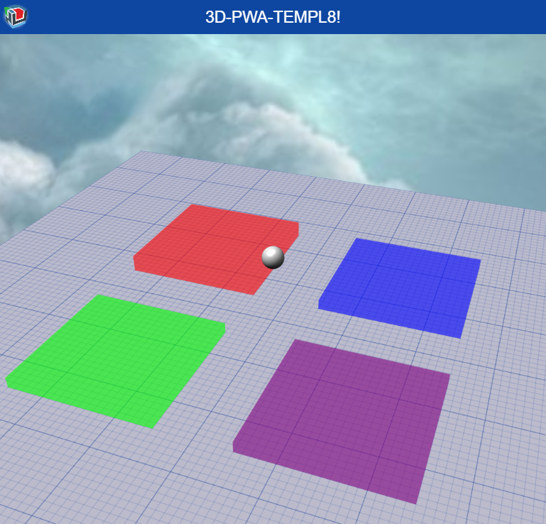
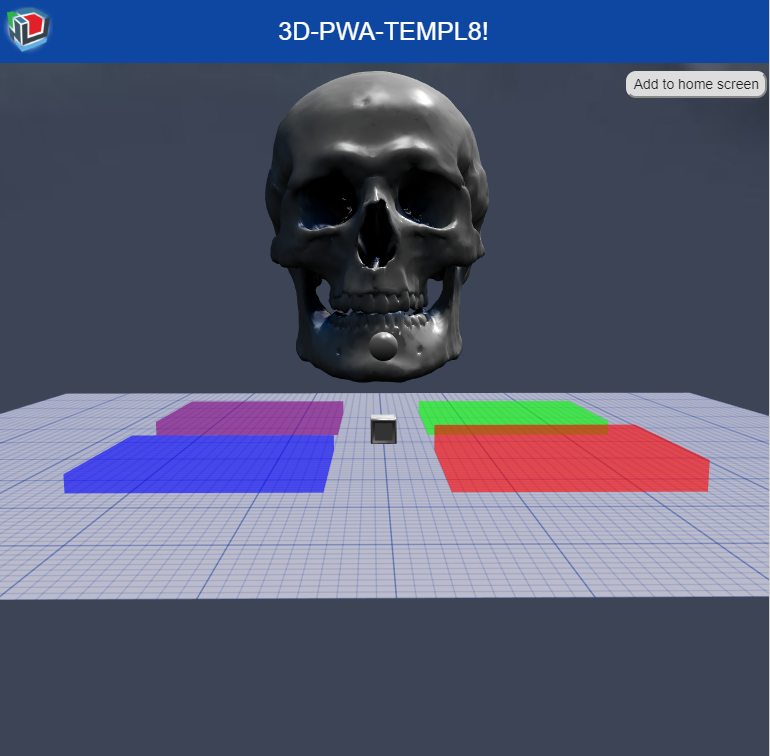

# 3D-PWA-TEMPL8
PWA Template with BabylonJS
# A 3D Progressive Web App Template

Powered by:

[](https://www.babylonjs.com/)

PWAs are the next wild west for creative HTML5 devs - and the world wide web. 

Now with BabylonJS, bring your 3D creations to the "Home Screen" with no app store necessary.

Use this template to begin building and distributing your 3D PWAs. 


## WARNING

Check W3C compatibility tables before going to production. PWA technology is subject to change. Look for [Manifest support as a good example of technical maturation](https://developer.mozilla.org/en-US/docs/Web/Manifest#Browser_compatibility). Zing!


## Create your own 3D Web App (why not?)

Clone me - I'm free. Follow these steps:  



- [Use BabylonJS to add your own snazz](https://doc.babylonjs.com/).




## Use the app

It caches the skybox, 3D assets, and audio!?!

Check out those cached files in the DevTools console.

Add to homescreen, splashscreen, and push updates.

PWAs are trans-dimentional. No way!


## App Shell

PWAs have a DESIGN PATTERN called "App Shell". Get with it, it's really clever. App Shell is just a separation of content code from app code... for the purpose of caching. Why? So you can download lots of content - and never reload the shell! Dig? Use this template as your App Shell! The canvas is one example of dynamic content, but later we will look for LocalStorage to become episodic content in beautiful JSON form.


## Service Workers

Service Workers are widely supported across browsers, apparently, but be sure to check that [compatibility table](https://developer.mozilla.org/en-US/docs/Web/API/ServiceWorker#Browser_compatibility) before running amok on safari. 

"This is an experimental technology" <- gotta love it!
NOTE: there is a small learning curve for looking carefully under the Devtools > Application tab and also > Network.


## Web Server for Chrome

If you haven't already - you really need to get with the [Web Server for Chrome](https://developers.google.com/web/fundamentals/codelabs/your-first-pwapp/#install_and_verify_web_server)). It is the future.


## Add to Homescreen

This is the cool new ability provided by the simple "JSON Manifest". Thank you [W3C](https://www.w3.org/TR/appmanifest/). 
NOTE: there is a small learning curve for a few topics like: how do I uninstall? And how do I set up a button to "Add to Homescreen"? All answers revealed in the code (if you can find it), and thankfully - all many doors revealed [here](https://developer.mozilla.org/en-US/docs/Web/Apps/Progressive/Installable_PWAs)


## Structure

```
├── README.md
├── MIT-LICENSE
├── App_Curation
└── public
    ├── 3d
    │   └── assets
    │   └── ...
    ├── img
    │   └── logos
    │   └── ...
    ├── lib
    │   └── babylon
    │   └── materialize
    │   └── jquery
    │   └── ...
    ├── app.js
    ├── index.html
    ├── manifest.json
    └── sw.js
```


## Libs

- [BabylonJS](https://www.babylonjs.com/) Not your grandpa's 3D Web rendering library.
- [JQuery](https://jquery.com/) hybrid 3D and 2D is not only healthy - it is good for you too!
- [Materialize](http://materializecss.com/). CSS boilerplate.


## Examples

Hosted on anymscape.com with heroku:


## Resources

- [Your First Progressive Web App - Google Developers](https://developers.google.com/web/fundamentals/codelabs/your-first-pwapp/)
- [ryanwhocodes/qr-code-pwa](https://github.com/ryanwhocodes/qr-code-pwa)
- [qr-code-pwa.firebaseapp.com/](https://qr-code-pwa.firebaseapp.com/)
